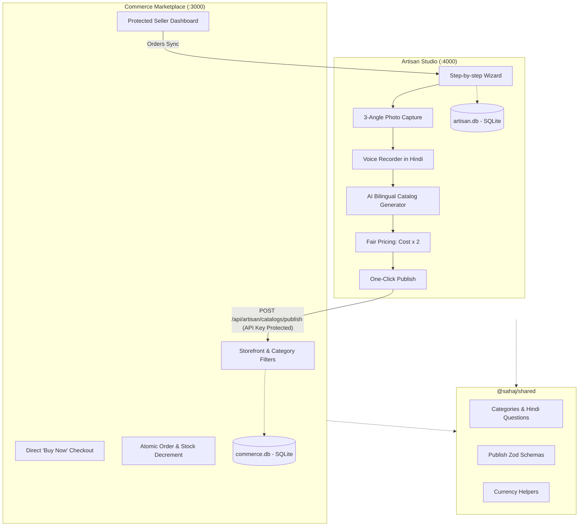

# Sahaj (सहज) — AI-Driven Market Linkage & Smart Cataloging for Marginalized Artisans

[](https://nextjs.org/)
[](https://react.dev/)
[](https://www.typescriptlang.org/)
[](https://www.prisma.io/)
[](https://www.sqlite.org/)
[](https://github.com/)
[](https://nodejs.org/)

> **Smart India Hackathon (SIH) Prototype**: Connecting rural and marginalized craftspeople to mainstream e-commerce through voice-first cataloging, automated bilingual translation, fair price discovery, and instant one-click market publishing.

---

## 📑 Table of Contents

- [Overview & Vision](#overview--vision)
- [Architecture & Tech Stack](#architecture--tech-stack)
- [Key Features](#key-features)
- [System Requirements](#system-requirements)
- [Quick Start (Local Setup)](#quick-start-local-setup)
- [Demo Walkthrough & Credentials](#demo-walkthrough--credentials)
- [Pushing to GitHub](#pushing-to-github)
- [Deploying to Cloud from GitHub](#deploying-to-cloud-from-github)
  - [Option 1: Docker / Docker Compose (Recommended)](#option-1-docker--docker-compose-recommended)
  - [Option 2: Vercel Monorepo Deployment](#option-2-vercel-monorepo-deployment)
  - [Option 3: Railway / Render Deployment](#option-3-railway--render-deployment)
  - [Option 4: Cloud VPS (Ubuntu, AWS EC2, DigitalOcean)](#option-4-cloud-vps-ubuntu-aws-ec2-digitalocean)
- [Continuous Integration (CI/CD)](#continuous-integration-cicd)
- [Testing & Quality Gates](#testing--quality-gates)
- [Repository Structure](#repository-structure)
- [License & Acknowledgments](#license--acknowledgments)

---

## 🌟 Overview & Vision

Marginalized artisans possess immense craft heritage but frequently face severe digital, linguistic, and commercial barriers when attempting to sell online. Traditional e-commerce platforms demand complex SKU setups, English typing skills, high upfront listing fees, and opaque pricing algorithms.

**Sahaj (सहज)** solves this through two interconnected web applications:

1. **Artisan Studio App (`:4000`)**: A voice-first, step-by-step assistant where the artisan captures 3 photos, answers 3 guided craft questions in Hindi via voice recording, receives instant AI-assisted bilingual catalog generation and fair pricing recommendations, and publishes with a single tap.
2. **Commerce Marketplace App (`:3000`)**: An editorial handicraft marketplace for conscious buyers, featuring category browsing, direct atomic "Buy Now" checkout, and a dedicated Seller Dashboard for tracking orders and inventory.

---

## 🏗️ Architecture & Tech Stack



### Core Technologies
- **Monorepo Management**: npm Workspaces (`apps/commerce`, `apps/artisan`, `packages/shared`).
- **Framework**: [Next.js 15 (App Router)](https://nextjs.org/) with React 19.
- **Language**: TypeScript 5.9 with strict type safety.
- **Database & ORM**: [Prisma 6.19](https://www.prisma.io/) with dual isolated [SQLite](https://www.sqlite.org/) databases.
- **Validation**: [Zod 3](https://zod.dev/) at all API boundaries and mutations.
- **Styling**: Tailored, accessible Vanilla CSS with warm-neutral tones, high-contrast text, and responsive tap targets.
- **Icons**: [Lucide React](https://lucide.dev/).

---

## 🚀 Key Features

| Capability | Artisan Studio (`:4000`) | Commerce Marketplace (`:3000`) |
| :--- | :--- | :--- |
| **User Interface** | Linear, voice-first wizard for low-literacy artisans | Editorial handicraft marketplace & seller portal |
| **Product Media** | Exactly 3 photos (Primary, Detail, Texture) with preview | Responsive galleries, local SVG art + Studio uploads |
| **Voice Capture** | In-browser `MediaRecorder` answering 3 Hindi questions | Bilingual English/Hindi toggle on product pages |
| **AI Cataloging** | Generates title, description, bullets, and craft specifics | Rich SEO metadata and search keyword indexing |
| **Pricing** | Automated fair price formula (`materialCost × 2`) | Transparent pricing in Indian Rupees (₹) |
| **Market Linkage** | Instant server-to-server publishing to Commerce | Idempotent catalog upserting with stable URLs |
| **Commerce Flow** | Live dashboard displaying orders fetched from Commerce | Direct "Buy Now" checkout, atomic inventory decrement |
| **Seller Tools** | Consolidated orders view and catalog status tracking | Protected dashboard: revenues, inventory, order statuses |

---

## 📋 System Requirements

Please review [REQUIREMENTS.md](REQUIREMENTS.md) for full specifications.

### Prerequisites Summary
- **Node.js**: `v20.0.0` or higher (`v22.x LTS` recommended).
- **npm**: `v9.0.0` or higher.
- **Operating System**: Windows 10/11, macOS 12+, or Linux (Ubuntu/Debian).
- **Network**: Ports `3000` and `4000` must be available on localhost.
- **Browser**: Chrome, Edge, Safari, or Firefox with microphone permissions enabled.

---

## ⚡ Quick Start (Local Setup)

### 1. Clone the Repository
```bash
git clone https://github.com/<your-username>/sahaj-demo.git
cd sahaj-demo
```

### 2. Install Dependencies
```bash
npm install
```

### 3. Setup Databases & Seed Initial Data
```bash
# Generates Prisma clients and initializes SQLite schemas
npm run db:setup

# Seeds initial artisan sellers, products, and sample orders
npm run seed
```

### 4. Start Both Applications Concurrently
```bash
npm run dev
```

Both applications will launch simultaneously:
- 🛒 **Commerce Marketplace**: [http://localhost:3000](http://localhost:3000)
- 🎨 **Artisan Studio**: [http://localhost:4000](http://localhost:4000)

---

## 🔑 Demo Walkthrough & Credentials

### Default Demo Credentials
- **Seller Login**: [http://localhost:3000/seller/login](http://localhost:3000/seller/login)
  - **Email**: `demo@sahaj-market.test`
  - **Password**: `demo123`
- **Demo Seller ID**: `seller-demo`
- **Server API Key**: `local-demo-key`

### 3-Step Demo Flow
1. **Create Catalog as Artisan (`:4000`)**:
   - Navigate to [http://localhost:4000/catalogs/new](http://localhost:4000/catalogs/new).
   - Upload 3 sample photos and record audio answers (or use file upload fallback).
   - Review the generated bilingual title, description, and recommended pricing.
   - Click **Publish to Commerce** — the catalog receives a live listing URL.
2. **Buy as a Customer (`:3000`)**:
   - Open the live listing on [http://localhost:3000](http://localhost:3000).
   - Click **Buy Now**, enter buyer shipping details, and submit payment.
   - View the generated private receipt token and atomic stock decrement.
3. **Fulfill as Seller (`:3000/seller/dashboard`)**:
   - Log into the Seller Dashboard to view revenue metrics and update order status (`PAID` → `DISPATCHED` → `DELIVERED`).
   - Check the Artisan Studio dashboard (`:4000`) to confirm real-time order visibility.

---

## 📤 Pushing to GitHub

To deploy and publish your repository to GitHub, follow these step-by-step instructions:

### Step 1: Check Git Status
```bash
git status
```

### Step 2: Create a New Repository on GitHub
1. Go to [github.com/new](https://github.com/new).
2. Set **Repository name** (e.g., `sahaj-marketplace` or `sih-artisan-demo`).
3. Set visibility to **Public** or **Private**.
4. **Do not** initialize with a README, .gitignore, or license (we already have them!).
5. Click **Create repository**.

### Step 3: Commit and Push
Replace `<your-username>` and `<repo-name>` with your GitHub details:

```bash
# Add all files to staging
git add .

# Create initial commit
git commit -m "feat: complete Sahaj artisan studio and commerce marketplace monorepo"

# Ensure default branch is main
git branch -M main

# Add remote origin
git remote add origin https://github.com/<your-username>/<repo-name>.git

# Push code to GitHub
git push -u origin main
```

---

## ☁️ Deploying to Cloud from GitHub

### Option 1: Docker / Docker Compose (Recommended)
This is the easiest and most reliable method to deploy both applications together with persistent SQLite databases and uploads.

The repository includes a ready-to-use [Dockerfile](Dockerfile) and [docker-compose.yml](docker-compose.yml).

```bash
# Build and run containers in background
docker compose up --build -d

# Check running status
docker compose ps

# View container logs
docker compose logs -f
```

**Persistent Volumes configured:**
- `commerce-data`: Persists `commerce.db`
- `artisan-data`: Persists `artisan.db`
- `uploads-data`: Persists artisan media uploads under `/public/uploads`

---

### Option 2: Vercel Monorepo Deployment
You can deploy both Next.js applications directly from your GitHub repository onto Vercel.

#### 1. Deploy Commerce Marketplace:
1. Go to [vercel.com/new](https://vercel.com/new) and import your GitHub repository.
2. In **Project Name**, enter `sahaj-commerce`.
3. In **Root Directory**, click edit and select `apps/commerce`.
4. Under **Build and Output Settings**:
   - **Build Command**: `npm run db:setup && npm run build`
   - **Install Command**: `npm install`
5. Under **Environment Variables**, add:
   - `COMMERCE_APP_URL`: `https://sahaj-commerce.vercel.app` (your actual Vercel URL)
   - `ARTISAN_APP_URL`: `https://sahaj-artisan.vercel.app`
   - `DEMO_API_KEY`: `your-production-secret-key`
   - `DEMO_SESSION_SECRET`: `your-strong-random-session-secret`
6. Click **Deploy**.

#### 2. Deploy Artisan Studio:
1. Import the same repository again on Vercel.
2. In **Project Name**, enter `sahaj-artisan`.
3. In **Root Directory**, click edit and select `apps/artisan`.
4. Under **Build and Output Settings**:
   - **Build Command**: `npm run db:setup && npm run build`
   - **Install Command**: `npm install`
5. Under **Environment Variables**, add:
   - `COMMERCE_APP_URL`: `https://sahaj-commerce.vercel.app`
   - `ARTISAN_APP_URL`: `https://sahaj-artisan.vercel.app`
   - `DEMO_API_KEY`: `your-production-secret-key`
6. Click **Deploy**.

> ⚠️ **Note for Serverless Platforms**: Vercel functions use ephemeral storage. Any uploads or SQLite writes made during runtime will not persist across function cold starts. For long-term production, use Option 1 (Docker/VPS) or integrate cloud storage (AWS S3 / Cloudflare R2) and a cloud database (Turso / Supabase / PostgreSQL).

---

### Option 3: Railway / Render Deployment

#### Deploying on Render:
1. Connect your GitHub repository to [Render.com](https://render.com).
2. Choose **Web Service** and select **Docker** as the runtime environment.
3. Attach a Persistent Disk mounted at `/app/apps/artisan/public/uploads` and `/app/apps/commerce/prisma`.
4. Configure environment variables (`COMMERCE_APP_URL`, `ARTISAN_APP_URL`, `DEMO_API_KEY`, `DEMO_SESSION_SECRET`).
5. Render will automatically build the `Dockerfile` and publish your service.

#### Deploying on Railway:
1. Create a **New Project from GitHub Repo** on [Railway.app](https://railway.app).
2. Railway will detect the `Dockerfile` automatically.
3. Add a persistent volume under **Settings > Volumes**.
4. Set ports `3000` and `4000`.

---

### Option 4: Cloud VPS (Ubuntu, AWS EC2, DigitalOcean)

Deploy using Node.js and PM2 on a standard Linux server:

```bash
# 1. Clone repository
git clone https://github.com/<your-username>/<repo-name>.git /var/www/sahaj
cd /var/www/sahaj

# 2. Install dependencies & build
npm install
npm run db:setup
npm run seed
npm run build

# 3. Start with PM2 process manager
npm install -g pm2
pm2 start npm --name "sahaj-commerce" -- run start -w @sahaj/commerce
pm2 start npm --name "sahaj-artisan" -- run start -w @sahaj/artisan
pm2 save
pm2 startup
```

Configure Nginx as a reverse proxy:
- Forward domain `market.yourdomain.com` to `http://127.0.0.1:3000`
- Forward domain `artisan.yourdomain.com` to `http://127.0.0.1:4000`
- Enable HTTPS via Let's Encrypt (`sudo certbot --nginx`).

---

## 🔄 Continuous Integration (CI/CD)

The repository includes an automated GitHub Actions CI pipeline in [.github/workflows/ci.yml](.github/workflows/ci.yml).

On every `push` or `pull_request` to `main` or `master`:
- Checks out code on `ubuntu-latest`.
- Sets up Node.js 22 with npm caching.
- Installs dependencies cleanly (`npm install`).
- Prepares Prisma clients and schemas (`npm run db:setup`).
- Executes root integration tests (`npm test`).
- Runs commerce static structure and SVG checks.
- Runs artisan backend API and upload tests.
- Executes full Next.js production builds for both apps (`npm run build`).

---

## 🧪 Testing & Quality Gates

Run all automated test suites locally before pushing commits:

```bash
# 1. Run root integration tests (Categories, questions, and shared Zod schemas)
npm test

# 2. Run commerce static architecture & SVG validation
node apps/commerce/tests/static.test.mjs

# 3. Run artisan backend upload, MIME, and API unit tests
node --import tsx --test apps/artisan/lib/backend.test.ts

# 4. Verify Next.js production build for both apps
npm run build
```

---

## 📁 Repository Structure

```text
sahaj-demo/
├── .github/
│   └── workflows/
│       └── ci.yml                 # Automated GitHub Actions test & build workflow
├── apps/
│   ├── commerce/                  # Buyer marketplace & seller portal (:3000)
│   │   ├── app/                   # Next.js 15 App Router pages & API routes
│   │   ├── components/            # Storefront, gallery, checkout, and dashboard components
│   │   ├── lib/                   # Database client, auth, order and publish handlers
│   │   ├── prisma/                # SQLite schema and seed script
│   │   ├── public/art/            # Curated local handicraft SVG illustrations
│   │   ├── tests/                 # Static checks and integration test suite
│   │   ├── README.md              # Commerce-specific documentation
│   │   └── package.json
│   └── artisan/                   # Voice-first artisan cataloging studio (:4000)
│       ├── app/                   # Studio wizard, audio & image uploads, routes
│       ├── components/            # Step-by-step wizard, voice recorder, image uploaders
│       ├── lib/                   # Catalog DTO, upload validator, commerce client
│       ├── prisma/                # SQLite schema for catalogs
│       ├── public/uploads/        # User-uploaded artisan product images and audio
│       ├── README.md              # Artisan-specific documentation
│       └── package.json
├── packages/
│   └── shared/                    # Shared workspace package (@sahaj/shared)
│       ├── index.ts               # Shared categories, Hindi questions, Zod contracts
│       └── package.json
├── Dockerfile                     # Multi-stage production container image
├── docker-compose.yml             # Turnkey deployment with persistent volumes
├── .env.example                   # Master environment variables template
├── REQUIREMENTS.md                # Detailed system, hardware, and runtime requirements
├── package.json                   # Root monorepo orchestrator
└── README.md                      # Project documentation and deployment guide
```

---

## ⚖️ License & Acknowledgments

- **Prototype**: Developed for the **Smart India Hackathon** problem statement: *"AI-Driven Market Linkage and Smart Cataloging Mobile Application for Marginalized Artisans"*.
- **License**: MIT License. Open-source and freely extensible for social impact and craft revitalization.
